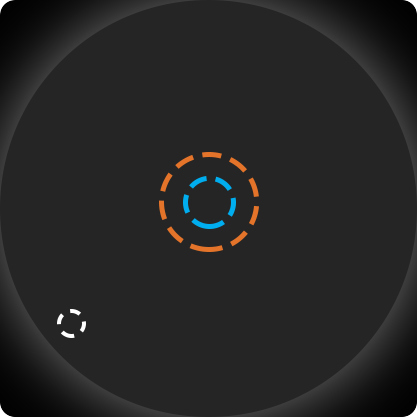
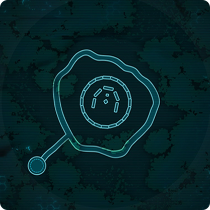
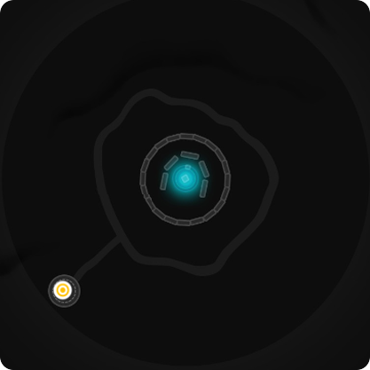

# ODMap  
Overlay map for Stonehenge Occult Defence.    
  
Missing features:  
There is no zoom.  
Portals are not visible. (doesn't seem possible)  
  
**Usage / Configuration**  
Map is only visible during Occult Defence scenario.  
Can be moved and resized while GUI is unlocked.  
`/option ODMap_HideMinimap true/false`[default:false] will control whether default minimap should be hidden or not  
`/option ODMap_TweakTimer  true/false`[default:false] will control whether timer background should be hidden or not  

You can change between 3 different map styles by editing config.xml  
  
  
You can edit config.xml which is included in the download to configure how mobs/map get displayed.  
By default:  
* Client = Orange arrow
* Other players = Green arrows
* Boss = Big orange skull  
* Commander,Titan = Huge red skull  
* Titanspawn = Small red skull  
* Singularity = Medium white dot, kept after death, also displays time since death  
* Healers = Green crosses  
* Flamecalled = flame  
* Zapper = Dynamite  
* Volatile = yellow dot
* Everything else = Red dot while not targeting player character, otherwise green dot
	
**Install**  
Downloads can be found under Releases section  
Unzip to `\Secret World Legends\Data\Gui\Custom\Flash`
