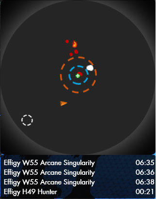

# ODMap  
Overlay map for Stonehenge Occult Defence.  
**Note** This mod is early on development and has not been tested in group play, or different resolutions.   
  
  
**Usage / Configuration**  
Map is only visible during Occult Defence scenario.  
`/option ODMap_HideMinimap true/false` will control whether default minimap should be hidden or not  
Can be moved and resized while GUI is unlocked.  
There is no zoom.  
Portals are not visible.  
  
You can edit config.xml which is included in the download to configure how mobs get displayed.  
By default:  
* Boss = Big orange skull  
* Commander,Titan = Huge red skull  
* Titanspawn = Small red skull  
* Singularity = Medium white dot, kept after death, also displays time since death  
* Healers = Green crosses  
* Flamecalled = flame  
* Zapper = Dynamite  
* Everything else = Red dot while not targeting player character, otherwise green dot
	
**Install**  
Downloads can be found under Releases section  
Unzip to `\Secret World Legends\Data\Gui\Custom\Flash`
